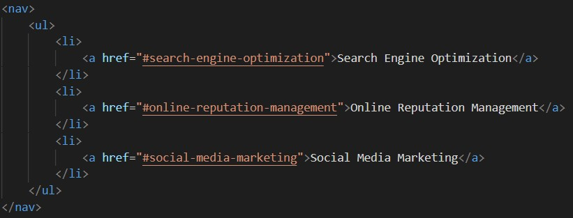

# HW1-Horiseon

## Description
- The task was to refactor an existing webpage and make it more accessible by adding semantic tags and alt attributes.

## Technologies Used
1. HTML5
2. CSS

## Essential Semantic Code

- The navigation tag is helpful to the user so they understand that these options are interactive to the page.

- The aside tag explains the content is different from the main content. It puts perspective to why the information is listed even though it's not in the main section.